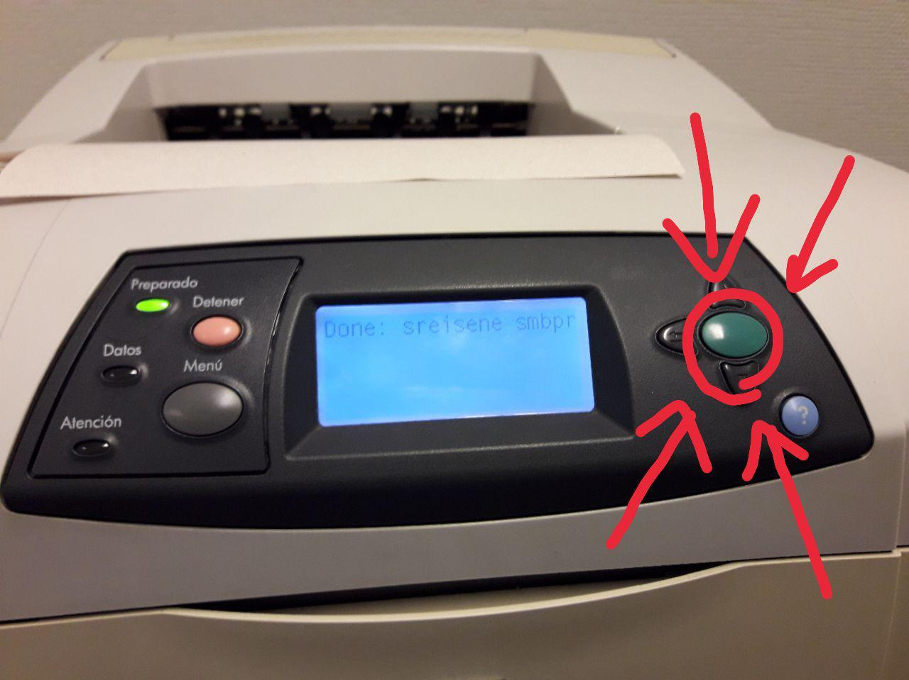

# FAQ de Impresoras

---

## ¿Cómo se cuentas impresiones me quedan?

En un computador con linux (como los del toqui) abre la terminal y conectate por ssh a anakena ([si usas windows haz click aquí](https://mediatemple.net/community/products/dv/204404604/using-ssh-in-putty-)), para eso escribe:

`ssh usuario@anakena.dcc.uchile.cl`

donde `usuario` corresponde a tu usuario del servidor Anakena. Te va a pedir tu contraseña de tu cuenta del DCC. Una vez dentro escribe `papel` y eso es todo. También puedes revisar la cuota de papel de tus amigos escribiendo `papel <nombre_de_usuario>`.

---

## ¿Cómo imprimo a través de la terminal como hacker en el DCC?

Antes de imprimir, es recomendable que transformen los archivos al formato .ps. Si el archivo es un PDF, primero deben asegurarse que esté en tamaño carta (lo más fácil es imprimirlo a un archivo PDF, y seleccionar el tamaño carta). Transformarlos evita que la impresora tenga que hacerlo, lo que es un proceso lento.

Luego, desde un computador del Toqui puedes escribir esto en la terminal
`lpr filename.ps`
Sin embargo, el archivo se imprime con la configuración por defecto (una página por hoja).

### Oye, ¿entonces cómo imprimo a doble cara?

Puedes usar el comando `duplex`, pero solo funciona en archivos con formato Postscript, así que primero debes escribir
`pdf2ps filename.pdf out.ps`
Y luego esto para imprimir en el toqui:
`duplex -l out.ps|lpr`
o esto para imprimir en la impresora de la salita:
`duplex -l out.ps|lpr -P hp-335`
y magia.

**Disclaimer:** El `-l` indica que el archivo se va a imprimir por el borde corto, si se omite se imprimirá por el borde largo.

Si estás desde tu computador tienes que primero copiar el archivo al servidor de anakena con scp:
`scp archivo.pdf usuario@anakena.dcc.uchile.cl:~/`
Y luego meterte a anakena con tu cuenta por ssh:
`ssh usuario@anakena.dcc.uchile.cl`
Y haces lo anterior como si estuvieras dentro de un computador en el Toqui (porque en teoría lo estas o:).

---

## AYUDA MI COSA NO SE IMPRIME Y LA HE MANDADO A IMPRIMIR 10^82 VECES

Ok calmate, puede ser que tengas que ir a la impresora a ver que es lo que está pasando.

Lo que ha pasado mucho ultimamente es que como distintas bandejas de la impresora tienen distintos tipos de papel hay que apretar un par de veces el botón verde grande para confirmar usar el papel de la bandeja.

Esto se puede evitar si desde el menú de impresión se selecciona explícitamente papel reciclado. Si no se hace esto, la impresora intenta buscar papel blanco y no lo encuentra.

---

## No era eso, me sigue sin imprimir mi cosa :c

Si sigues teniendo problemas puedes preguntar en sistemas en el tercer piso del edificio poniente ([ver mapa](https://faq.cadcc.cl/es/latest/Lugares%20Importantes/#tercer-piso-edificio-poniente)).
