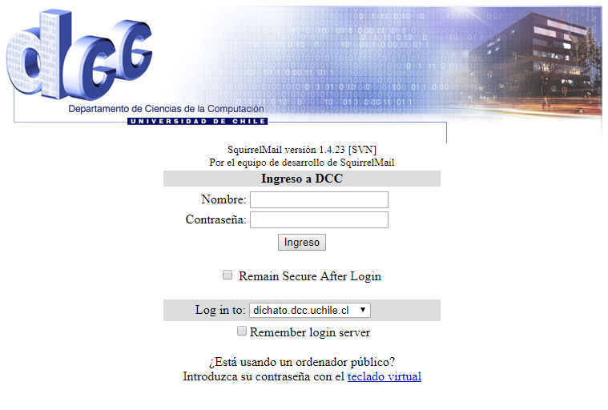
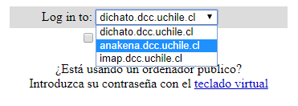
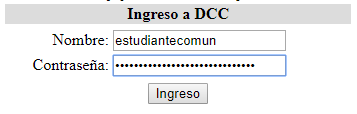
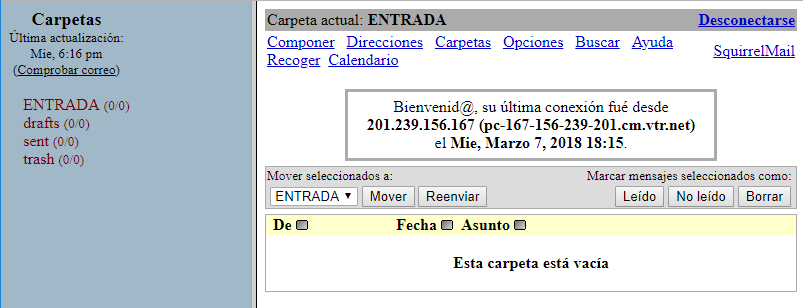

# FAQ Mechón

Recuerda también revisar la sección [Lugares Importantes](https://howto.cadcc.cl/es/latest/Lugares%20Importantes/) y [NPCs Importantes](https://howto.cadcc.cl/es/latest/NPCs%20Importantes/) para que te empieces a ubicar.

---

## ¿Qué es la Salita?

Es una sala de convivencia estudiantil que queda en el tercer piso del Edificio Norte de Beauchef 851 (Oficinas 333 y 334). Hay un refri, mesitas, tacitas, servicios, té y café para tomar desayunito, almuercito y oncesita; hay sillones para sentarse o dormir; y consolas, juegos de mesa y parlantes para jugar y distraerse un rato.

Debes saber que la Salita tiene sus reglas básicas de convivencia:

* Manten un nivel de ruido moderado, al menos hasta las 18:00. En el edificio hay varios funcionarios trabajando.
* Siempre **lava y devuelve las tazas y cubiertos que uses**. Al lado contrario del Edificio Norte, junto al baño de mujeres, está la cocina con un lavaplatos. Limpia inmediatamente el horno/refri si lo ensucias.
* El refrigerador es público. Si vas a dejar algo, asegúrate de marcarlo con tu nombre o podrá ser consumido por cualquiera. De igual forma, **no consumas nada con nombre**, ni siquiera si planeas "devolverlo después". Preocúpate de botar productos vencidos.

---

## ¿Qué es la Ofisalita?

La Oficina CaDCC aka Ofisalita es la sala ubicada justo al lado de la Salita (Oficina 332). En principio es la oficina del Centro de Alumnos, pero está abierta a todo público y es una opción un poco más relajada que la Salita. Puedes estar y/o trabajar en ella sin problemas. Tiene mesas, algunas pantallas y un rincón con un puff para dormir semi-escondido (aka *Hiho's Corner*). Es hogar del Kioskito CaDCC.

De vez en cuando el CaDCC requerirá la Ofisalita para reuniones esporádicas.

---

## ¿Qué es y dónde está el Kioskito?

El Kioskito CaDCC es la fuente de abundancia calórica-nutricional para mantener nuestras mentes y cuerpos vivos y redondos. Se ubica en la Ofisalita.

El Kioskito es completamente auto-servicio, existen tarros de monedas donde debes dejar tu pago *(de forma ordenada por favor D:)*. Recalcamos fervientemente que **NO SE FÍAN PRODUCTOS**, paga inmediatamente todo lo que retires. Con ese dinero financiamos las actividades para toda la comunidad y es un proyecto muy lindo basado en la confianza. ¡Cuidémoslo todos!

Por favor sé paciente si falta stock. Hacer las compras no es fácil, recuerda que somos estudiantes igual que tú :). ¡Te invitamos a ayudar con las compras y carga de mercadería cuando sea necesario!

---

## ¿Debería cambiar de código al entrar al DCC? ¿Cómo lo hago?

No es necesario cambiar de código para dar los ramos y estudiar en el DCC. Sin embargo, con el código tendrás acceso a las dependencias del Depto, a tu cuenta personal para el uso de computadores y servidores y 150 impresiones mensuales acumulables con un **máximo de 400**. Además no perderás tus impresiones del CEC. Cabe notar que al momento de titularte sí debes tener el código de la carrera.

Para cambiar de código debes ir a U-Campus → Workflow → Cambio de Carrera. Si vienes de Plan Común y es tu primer cambio, el proceso será inmediato, de lo contrario deberás esperar la aprobación.

---

## ¿Cómo activo mi TUI y cuenta para entrar al DCC?

Debes ir a hablar con Hernán a la oficina 309, en el tercer piso del Edificio Poniente en Beauchef 851. Tienes que haber cambiado de código y haber leído el [FAQ y las Normas de Uso](https://www.dcc.uchile.cl/node/252), ya que te harán preguntas antes de la activación.

---

## ¿Puedo pedir acceso al DCC sin tener el código?

Si estás cursando ramos con código CC, puedes solicitar acceso temporal por la duración del semestre, aunque no estés formalmente en la carrera. Para esto es necesario que el profesor del ramo autorice la activación antes de que puedas pedirla en Sistemas. Esto aplica también para los ramos de Taller de Proyecto realizados al interior del DCC (Lego/Alice).

---

## ¿Dónde se almuerza en el DCC? ¿Hay microondas?

El lugar mas apropiado para almorzar dentro del edificio es la Salita, donde hay refri y microondas cerca, pero lamentablemente se llena rápido :(.

Hay microondas en el pasillo fuera de la Salita y en las cocinas de todo el depto (Ver mapa), sin embargo, evita calentar almuerzos en el Edificio Poniente, pues el olor no se ventila bien y molesta a quienes trabajan ahí. También evita traer gente externa para aprovechar nuestros microondas, ya que muchas veces tienen alta demanda y sufren desgaste rápidamente. ¡Cuida tu depto!

---

## ¿Qué actividades recreativas se organizan en el DCC? ¿Juegan Minecraft?

Durante el año realizamos muuuchas actividades extracurriculares para fomentar y mantener nuestra bella comunidad. Dentro de las más típicas se destacan:

* Karaokes
* Tarreos (Age, Rocket League, Counter, consolas, PC, lo que querai)
* Tardes de Juegos de Mesa
* Tardes de Cine
* Just Dance

Además tenemos una Bienvenida Mechona cada semestre (usualmente una en el quincho CEI y otra en una parcela) y el connotado Paseo DCC en la playa.

Por último, cualquier alumno puede proponer una actividad a su querida Directiva de turno y siempre estarán dispuestos a hacer realidad sus sueños.

---

## Oye, en la pregunta anterior no respondiste si juegan o no Minecraft

Toda la razón, eres muy observador@.

---

## ¿Dónde puedo estudiar en el DCC?

Existen dos <s>distritos</s> salas de estudio ultra populares en el DCC:

El Lab. Toqui, una sala ubicada en el 2do piso del Edificio Poniente enfocada al estudio grupal con computadores, mesas, impresoras y escáneres. Puedes hacer ruido moderado en esta sala. Es útil para jugar juegos de mesa en grupo, pero recuerda evitar los gritos.

Y el Lab. Eniac, una sala silenciosa ubicada en el 3er piso del Edificio Poniente enfocada al trabajo individual solo con computadores, existe un acuerdo entre todos los estudiantes del DCC de mantener esta sala <s>silenciosa AF</s> lo más silenciosa posible. Cuenta con pantallas y espacios libres para que uses tu propio PC.

Además de las anteriores, los espacios abiertos y mesas del Edificio Poniente son de uso libre y existe un pequeño lugar de estudio al sur del Toqui con computadores, mesitas y una pizarra. Por lo general aquí se hacen reclamos así que no siempre estará 100% libre.

El Lab. Lorenzo, frente a la Salita, también es de uso libre para nosotros **siempre y cuando no haya clases**.

Igualmente y si no necesitas mucha concentración, puedes estudiar en la Salita o en la Ofisalita, que es un poco más silenciosa.

---

## ¿Por qué el DIM roba el agua del DCC?

¡PORQUE ES MUY RICA!

---

## ¿Cómo puedo usar los casilleros de afuera de la Salita?

A principio de año se abre un formulario para inscribirse. Por lo general un casillero cuesta 10.000 CLP <s>(Chilean Points)</s> y dada la demanda se recomienda pedirlos en parejas. Estamos tramitando la compra de nuevos casilleros.

---

## ¿Cómo puedo enterarme de las noticias del DCC?

El CaDCC tiene un [blog](cadcc.cl) en el cual se suben todas las noticias. Si quieres notificaciones, puedes unirte al [canal de Telegram](https://t.me/CaDCCInforma), al [grupo de Facebook](https://www.facebook.com/groups/CaDCCUchile/) o seguir al CaDCC en [Twitter](https://twitter.com/cadcc). El blog reenvía las noticias a todas esas redes, además de la [Comunidad de U-Cursos](https://www.u-cursos.cl/uchile/2008/0/COMCADCC/1/integrantes/postular).

---

## ¿Qué es el CaDCC? ¿Puedo ser parte de él?

<s>Pensé que jamás lo preguntarías</s> Es el Centro de Alumnos del Departamento de Ciencias de la Computación. El CADCC (Estilizado históricamente como CaDCC) es la organización de estudiantes que representa el conglomerado de estudiantes del DCC, procurando su bienestar, convivencia y protocolo. Son quienes organizan los eventos recreativos, charlas y actividades, y conforman el conducto regular en temas de docencia, comunicaciones, presupuestos, etc. Se elige de forma anual entre todos los interesados con un plebiscito.

Siendo formales, el CaDCC tiene tres principales compromisos con la comunidad:

* **Representación y Vocería.** El CaDCC representa y aboga por cada uno de sus miembros a nivel individual y comunitario, pudiendo ser intermediario entre ellos y cualquier ente o institución en toda instancia que le competa y requiera.
* **Integración y Participación**. Tiene el deber de velar porque cada alumno se sienta parte de la comunidad, manteniendo un ambiente grato y bajo el alero de la identidad institucional que nos caracteriza, donde todos sean escuchados y respetados.
* **Comunicación e Información**. Debe mantener al tanto de cualquier información relevante a todos los estudiantes del departamento.

Si quieres aportar al CaDCC, eres completamente bienvenido a comunicarte con cualquiera de sus miembros e incluirte en sus filas cuando quieras. ¡También puedes aportar con ideas o apoyo sin ser parte integral de la Directiva!

Puedes ver la actual directiva en [el blog](https://www.cadcc.cl/directiva/).

---

## ¿Cómo funcionan las prácticas en el DCC?

Te invito a ver el FAQ de prácticas (sorry si todavía dice coming soon, es culpa de Tomimi).

---

## ¿Como me meto a mi mail @dcc.uchile.cl desde un browser?

Primero metete a [webmail.dcc.uchile.cl](webmail.dcc.uchile.cl) y debería aparecerte esto:

Luego eliges el servidor al cual conectarte: Si eres estudiante de pregrado debes meterte a anakena.dcc.uchile.cl; Si eres de postgrado debes meterte a dichato.dcc.uchile.cl.

Luego escribe tu usuario y clave que registraste en sistemas para tener cuenta en el dcc en primer lugar.

¡Y listo, ya estas dentro!

Ojo, que si te metiste al servidor equivocado debería salirte una pantalla libre de spam así:

Si está libre de spam, sabes que te equivocaste porque el dcc manda spam mensual a estos mails.

---

## ¿Cómo imprimo a través de la terminal como hacker en el DCC?

Desde un computador del Toqui puedes escribir esto en la terminal
`pdf2ps filename.pdf out.ps`
Y luego esto:
`duplex -l out.ps|lpr -P hp-335`
y magia.

Si estás desde tu computador tienes que primero copiar el archivo al servidor de anakena con scp:
`scp archivo.pdf usuario@anakena.dcc.uchile.cl:~/`
Y luego meterte a anakena con tu cuenta por ssh:
`ssh usuario@anakena.dcc.uchile.cl`
Y haces lo anterior como si estuvieras dentro de un computador en el Toqui (porque en teoría lo estas).

---

## ¿Cómo me meto a DCCAIR?

Te dejamos con el [Tutorial Oficial para meterse al Wifi del DCC™](https://www.dcc.uchile.cl/wifi).

---

## ¿Es verdad que puedo tomar mates financieras (IN4301) en vez de evalua?

No pero si. El problema es que existen ramos de malla que te piden evaluación de proyectos, pero los puedes tomar igual si es que tienes más de 264 SCT. (Porque si tienes mas de 264 SCT puedes tomar cualquier ramo independiente de los requisitos). A pesar de lo anterior definitivamente no lo recomendamos.

---

### Contacto

Si tienes dudas o quieres decirnos sobre una fallla de la página (esa última falla fue a proposito) al mail faqme@cadcc.cl y trataremos de responderlas lo mejor posible. Si es muy usual tu duda la incluiremos en los FAQ's :D
