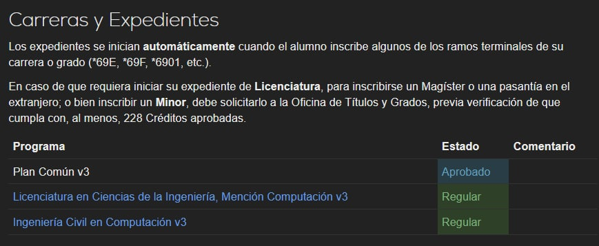
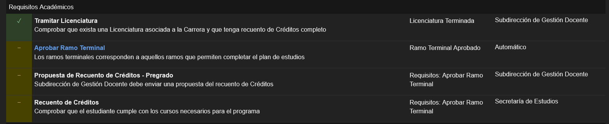
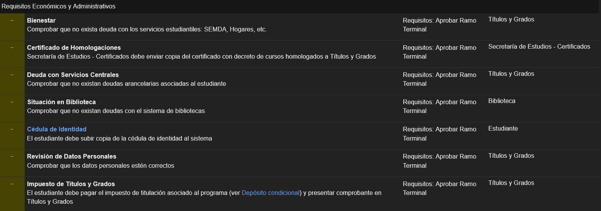
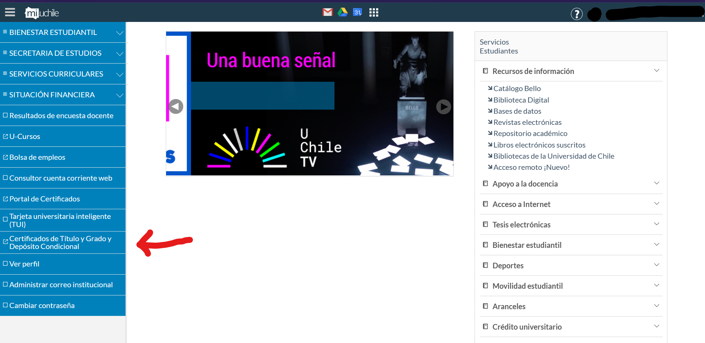
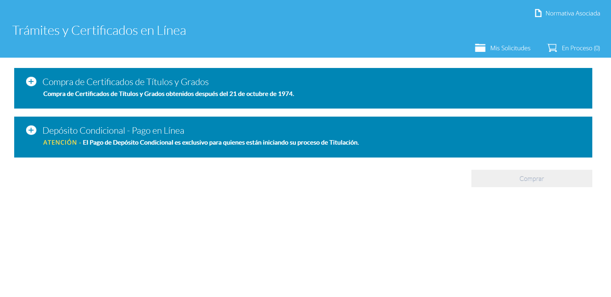
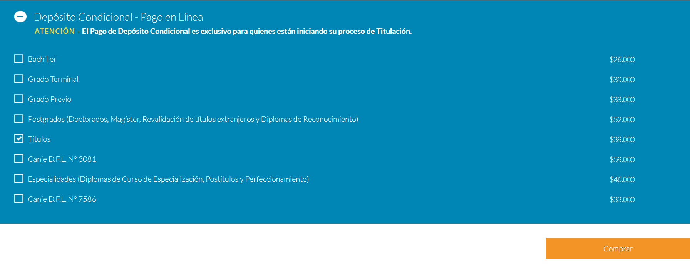
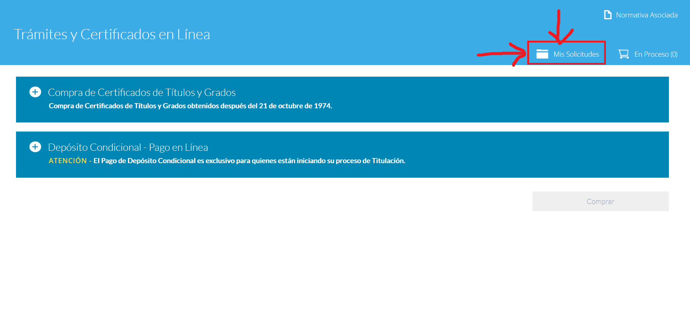
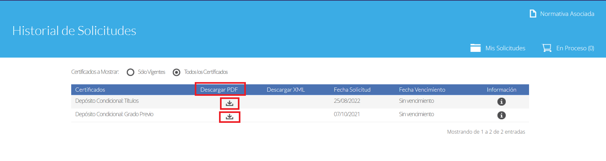
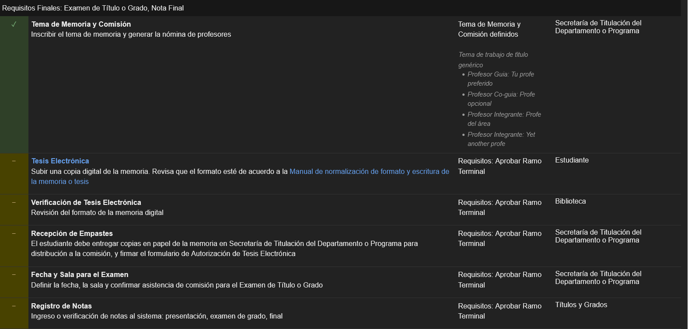
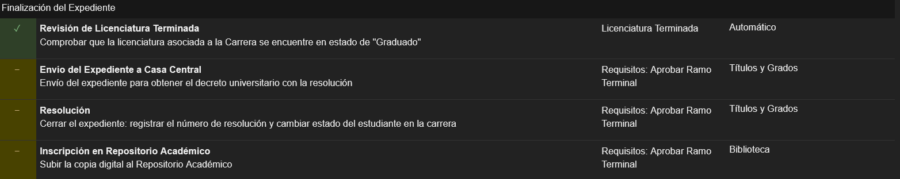

# La burocracia universitaria

No todo el proceso de titulación consiste en trabajar y escribir tu memoria/tesis. También hay unos pasos burocráticos que la universidad te pide para poder titularte.

## ¡¿Qué más quieren de mí?!

Tranqui, la verdad es que solo requiere que mandes un par de correos y debes estar pendiente para algunos pasos que requieren tu atención. Cuando inscribes el E se desbloquea una nueva sección en ucampus llamada [Títulos y Grados](https://ucampus.uchile.cl/m/fcfm_titulacion2/) donde aparecen tus datos personales y más abajo sale un apartado de este estilo:

Bueno, vamos a explicar esto con la ingeniería porque tiene más pasos y algunos no se cachan bien.

## El Expediente™

Para poder titularte y obtener el [prestigio](https://http2.mlstatic.com/kit-10-chocolate-nestle-prestigio-D_NQ_NP_996339-MLB26579473295_122017-F.jpg) de hacerte llamar ingenier@ de la Universidad de Chile, necesitas completar una serie de procesos detallados en el expediente de la carrera. Para evitar un _wall of text_ o una imagen gigante que no se verá, se van a desglosar los procesos según el tipo de requisitos que aparecen en la página.

### Requisitos Académicos

* **Tramitar licenciatura**: Si llegaste al F y no tienes esto listo, partiste a empezar el trámite altiro si ya cuentas con los ramos de la licenciatura. Si estás dando EHs todavía, vas a tener que esperar que suban el acta. En cualquier caso, para la licenciatura es lo mismo que se detalla más adelante en la propuesta del recuento de créditos y el apartado de requisitos económicos y administrativos.
* **Aprobar Ramo Terminal**: En este caso, esperar que suban el acta del F después de que tu comisión envíe sus comentarios y las notas que te pusieron. La nota es el promedio simple de las notas que te asignó cada profesor de la comisión.
* **Propuesta de Recuento de Créditos - Pregrado**: Ya, esta es la parte chistosa donde parte todo. Tienes que mandar un correo a Títulos y Grados FCFM (más específicamente a **gerardo.troncoso(at)u.uchile.cl**, por lo menos al momento de escribir esta sección) diciendo que quieres iniciar el recuento de créditos para la ingeniería. Eventualmente alguien mandará tu recuento y el ticket estará completado. Esto también aplica para iniciar la tramitación de la licenciatura.
* **Recuento de Créditos**: Estará en verde cuando acepten la propuesta del paso anterior y podrás ver la lista de ramos incluidos. A partir de este paso tu estado de la carrera cambia a **Egresado**.

### Requisitos Económicos y Administrativos

* **Bienestar, Certificado de Homologaciones, Deuda con Servicios Centrales y Situación en Biblioteca**: Estos 4 pasos están juntos porque la verdad es que deberían haber empezado a correr cuando mandaste el correo para iniciar el recuento de créditos, no tienes nada que hacer acá más que esperar.
* **Cédula de Identidad**: Sube una fotocopia de tu carnet por ambos lados. Eso.
* **Revisión de Datos Personales**: Revisan que tus datos estén bien. Para esto tienes que avisar, a la misma persona que le enviaste el correo del recuento de créditos, que te falta la verificación de tus datos y te envían un PDF con los datos a verificar y que tienes que firmar.
* **Impuesto de Títulos y Grados**: La otra parte chistosa de todo esto, también tuviste que hacer esto para la licenciatura excepto que ahora desbloqueas este trámite después de que biblioteca haya aceptado tu documento y esté aprobada la recepción de empastes (Ver la sección siguiente sobre **Requisitos Finales: Examen de Título o Grado, Nota Final**).

    Para pagar el impuesto tienes que ingresar con tu cuenta a [mi.uchile.cl](https://mi.uchile.cl) y hacer click donde dice **Certificados de Titulo y Grado y Depósito Condicional**:
    

    Desde ahí se te va a redirigir a una página como esta:
    

    Si haces click en el "+" al lado de **Depósito Condicional - Pago en Línea** aparecen las siguientes opciones:
    

    Si estás todavía tramitando la licenciatura, tienes que seleccionar la opción que dice **Grado Previo**, pero si estás pagando el impuesto para la ingeniería debes seleccionar la que dice **Títulos**.

    Una vez seleccionada tu opción le das al botón de **Comprar** y sigues las instrucciones para pagar.

    _Un pago después._

    Ahora que le diste algo de tu plata a la universidad, tienes que enviar el comprobante. ¿Recuerdas la página donde tuviste que escoger el depósito condicional? Tienes que volver y hacer click en mis solicitudes:
    

    Y te aparecerá una vista como esta:
    

    En la columna de **Descargar PDF** haces click en el ícono del comprobante del depósito condicional que quieres descargar (Grado Previo para la licenciatura y Títulos para la ingeniería). Con eso ya puedes enviar el comprobante a Títulos y Grados. Este paso termina cuando revisan el comprobante que les enviaste.

### Requisitos Finales: Examen de Título o Grado, Nota Final

* **Tema de Memoria y Comisión**: Se explica por sí solo lo que es. Inicialmente solo aparece tu tema y tu profe guía (y co-guía si corresponde), unas semanas antes de la entrega del informe sin prórroga aparecen los 2 miembros restantes de la comisión. Por lo general suelen ser un académico del área del tema de memoria y alguien ajeno al área.
* **Tesis electrónica**: Aquí subes la versión finalfinal100%realnofakemegauploadmedicina de tu memoria. También debes subir el texto de tu resumen (un copy paste de tu sección Resumen del documento) y palabras clave relacionadas con tu trabajo.
* **Verificación de Tesis Electrónica**: Si biblioteca no encuentra fallas en el formato del documento, este paso se completa. De lo contrario, vas a tener que iterar hasta que te lo acepten.
* **Recepción de empastes**: En tiempos pre pandémicos había que entregar una copia impresa de la memoria a cada miembro de la comisión y a la biblioteca. Sin embargo, ahora tenemos _tecnología_, por lo que ya no es necesario pero igual hay que completar este paso, así que envíale un correo a Sandra diciéndole que ya completaste el paso anterior.
* **Fecha y Sala para el Examen**: Ponte de acuerdo con tu comisión para ~~exigir un juicio por combate~~ fijar la fecha y hora de tu defensa. Prepara tu presentación y tus habilidades para hablar y resumir, que tienes 20 minutos para resumir tu trabajo de los últimos 2 semestres. Para este paso todos los anteriores ya debieron haberse completado.
* **Registro de Notas**: ¡Felicidades! Ya pasó la defensa y eres un elfo libre con el calcetín y todo eso. Ingresan tus notas al sistema.

### Finalización del expediente

Aquí no tienes que hacer nada, solo esperar a que se completen los procesos.
